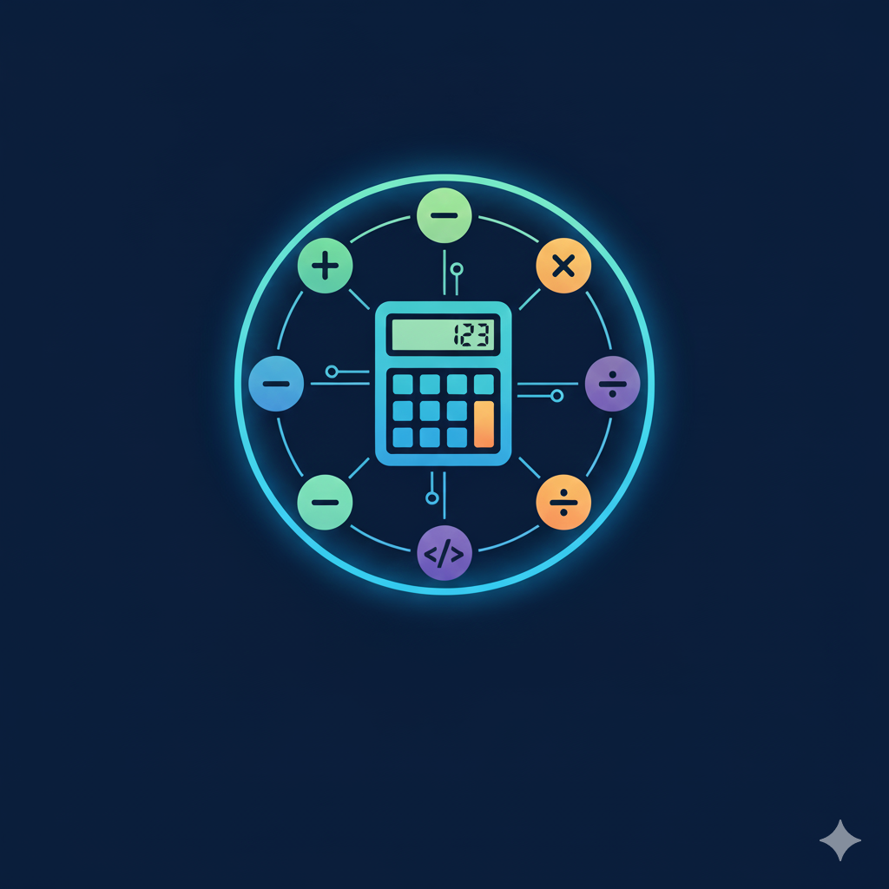

# 🧮 Calculadora Web

<p align="center">
  
</p>

Bem-vindo ao **Calculadora Web**, uma aplicação simples e funcional desenvolvida com HTML, CSS e JavaScript. Este projeto tem como objetivo fornecer uma interface intuitiva para realizar operações matemáticas básicas diretamente no navegador.

---

## 🔧 Funcionalidades

- **Operações Básicas**: Soma, subtração, multiplicação e divisão.
- **Interface Responsiva**: Adaptável a diferentes tamanhos de tela.
- **Design Limpo e Intuitivo**: Foco na experiência do usuário.

---

## 🛠️ Tecnologias Utilizadas

- **HTML5**: Estruturação do conteúdo.
- **CSS3**: Estilização e layout.
- **JavaScript**: Lógica das operações e interatividade.

---

## 🚀 Como Executar

1. Clone este repositório:
   ```bash
   git clone https://github.com/Gabrielli-Rech/Calculadora-Web.git
2. Navegue até a pasta do projeto:
   cd Calculadora-Web
3. Abra o arquivo index.html em seu navegador preferido.

Calculadora-Web/<br>
├── App/<br>
│   └── View/<br>
│       └── Imagens/<br>
│           └── logo.png      # Logo da aplicação<br>
├── index.html               # Página principal<br>
├── script.js                # Lógica JavaScript<br>
└── style.css                # Estilos da aplicação<br>

🎨 Personalização

Sinta-se à vontade para personalizar a aparência da calculadora editando o arquivo style.css ou adicionar novas funcionalidades modificando o script.js.


